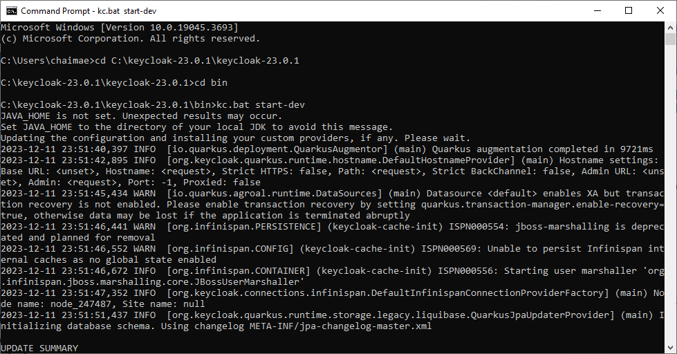
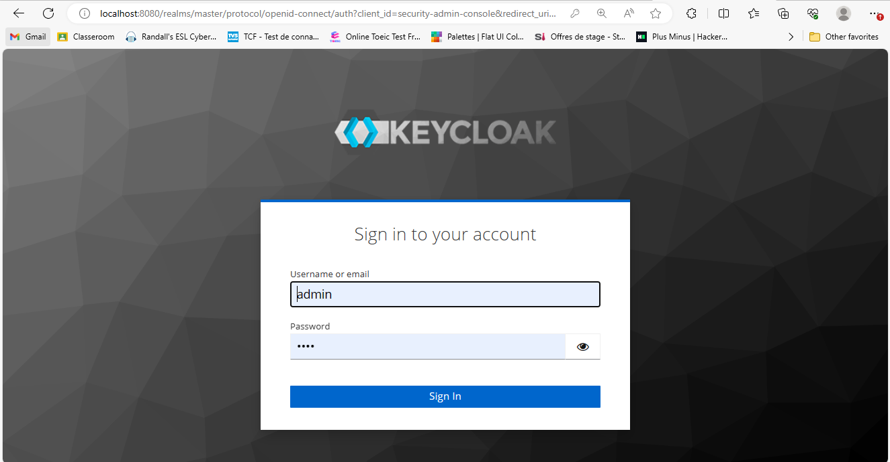
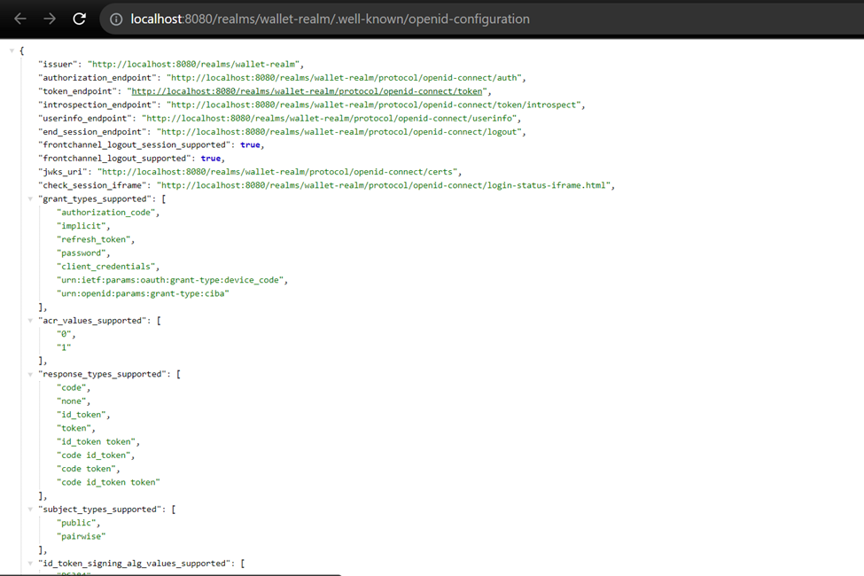
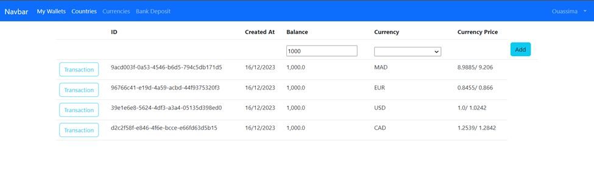

# Sécurisation des Micro services avec Keycloak

**_Plan_ :**
<ul>
    <li>Téléchargement de Keycloak et installation - lien : <a href="https://www.keycloak.org/downloads.html">https://www.keycloak.org/downloads.html</a></li>
    <li>Démarrage Keycloak</li>
    <li>Création d'un compte Admin</li>
    <li>Création d'une Realm</li>
    <li>Création d'un client à sécuriser</li>
    <li>Création des utilisateurs</li>
    <li>Création des rôles</li>
    <li>Affectation des rôles aux utilisateurs</li>
    <li>Dans Postman :
        <ul>
            <li>Test l'authentification via password et username</li>
            <li>Analyse les contenus de JWT Access Token</li>
            <li>Teste l'authentification avec Refresh Token</li>
            <li>Teste l'authentification avec client ID et client secret</li>
        </ul>
    </li>
    <li>Sécuriser les Micro services wallet-service, ebank-service</li>
    <li>Teste les endpoints de micro-services ebank-service par HTTP Client</li>
    <li>Teste les endpoints de micro-services wallet-service par GraphQL</li>
</ul>

<p align="center">
  
</p>

## Démarrage de Keycloak
<p align="center">
  
</p>

<p align="center">
  
</p>

## Connecter à Keycloak
<p align="center">
  
</p>

## Créer un nouveau realm
<p align="center">
  
</p>

<p align="center">
  
</p>

## Créer un nouveau client
<p align="center">
  
</p>

<p align="center">
  
</p>

<p align="center">
  
</p>

## Créer un nouveau Utilisateur
<p align="center">
  
</p>

## Attribuer un mot de passe à l'utilisateur
<p align="center">
  
</p>

<p align="center">
  
</p>

## Créer un nouveau rôle
<p align="center">
  
</p>

<p align="center">
  
</p>

## Affecter le rôle à l'utilisateur
<p align="center">
  
</p>

## Entrer Realm Settings pour récupérer le token
<p align="center">
  
</p>

<p align="center">
  
</p>

## 1 ere solution : authentification via password et username
<p align="center">
  
</p>

<p align="center">
  
</p>

## 2 éme solution : authentification via refresh token
<p align="center">
  
</p>

## activer client authentification =>l’application qui envoie la requête qui va authentifier et n’est pas l’utilisateur
<p align="center">
  
</p>

<p align="center">
  
</p>

# Sécuriser Les Micro services wallet-service, ebank-service 

## Ajouter des dépendances dans le pom.xml de chaque micro service

```bash
<dependency>
   <groupId>org.springframework.boot</groupId>
   <artifactId>spring-boot-starter-security</artifactId>
</dependency>
<dependency>
   <groupId>org.keycloak</groupId>
   <artifactId>keycloak-spring-boot-starter</artifactId>
   <version>23.0.0</version>
</dependency>
```
## Configuration de la sécurité de l'application

```java
@Configuration
// Cette classe permet de configurer la sécurité de l'application en utilisant Keycloak.
public class KeycloakAdapterConfig {
@Bean
// Ce bean indique à Keycloak de lire la configuration à partir du fichier application.properties.
public KeycloakSpringBootConfigResolver springBootConfigResolver(){
return new KeycloakSpringBootConfigResolver();    // Cela signifie que la configuration de Keycloak sera basée sur le fichier application.properties plutôt que keycloak.json.
}
}
```

```java
// Cette classe combine les annotations @Configuration, @EnableWebSecurity et @EnableGlobalMethodSecurity(prePostEnabled = true).
@KeycloakConfiguration
@EnableGlobalMethodSecurity(securedEnabled = true)
public class SecurityConfig extends KeycloakWebSecurityConfigurerAdapter {
// Cette méthode configure la stratégie d'authentification.
@Override
protected SessionAuthenticationStrategy sessionAuthenticationStrategy() {
return new RegisterSessionAuthenticationStrategy(new SessionRegistryImpl());
// Elle permet de définir la stratégie d'authentification utilisée par l'application.
}

    // Cette méthode configure le gestionnaire d'authentification.
    @Override
    protected void configure(AuthenticationManagerBuilder auth){
        auth.authenticationProvider(keycloakAuthenticationProvider());
        // Cette configuration indique que la gestion des utilisateurs et des rôles est déléguée à Keycloak,
        // ce n'est pas à cette application de gérer directement les utilisateurs et les rôles.
    }

    // Cette méthode configure les autorisations, c'est-à-dire les droits d'accès.
    @Override
    protected void configure(HttpSecurity http) throws Exception {
        super.configure(http); // Configure les aspects de sécurité par défaut.
        http.csrf().disable(); // Désactive la protection CSRF car elle n'est pas utile pour une API REST.
        http.authorizeRequests().antMatchers("/h2-console/**").permitAll(); // Autorise l'accès à la console H2.
        http.headers().frameOptions().disable(); // Désactive les options de frame pour la console H2 pour permettre l'affichage de la console.
        http.authorizeRequests().anyRequest().authenticated();  // Toutes les autres requêtes nécessitent une authentification.
    }
}
```
## Teste les endpoints de micro-services ebank-service par HTTP Client
<p align="center">
  
</p>

<p align="center">
  
</p>

<p align="center">
  
</p>

<p align="center">
  
</p>

## Teste les endpoints de micro-services wllet-service par GraphQL
**query => comme select**
**mutation => tout ce qui est post, put, delete…**

<p align="center">
  
</p>

<p align="center">
  
</p>

<p align="center">
  
</p>

**car on envoie la requete vers ebank qui est sécurisé**
<p align="center">
  
</p>

## Wallet Frontend Angular Secured
**Authentification via Keycloak**
<p align="center">
  
</p>

```bash
npm install --save bootstrap bootstrap-icons
npm install --save keycloak-js keycloak-angular
```
<p align="center">
  
</p>

<p align="center">
  
</p>

<p align="center">
  
</p>

<p align="center">
  
</p>

<p align="center">
  
</p>

